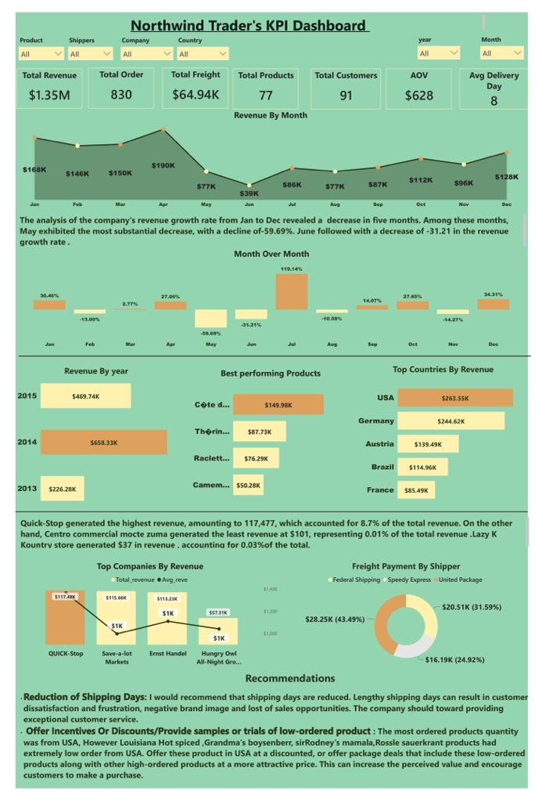

# Northwind-Business-Analysis-

## Introduction
This is my submission for the Maven Analytics Project. The project involved conducting a thorough analysis of the Sales and Order data for Northwind Traders, a fictional gourmet food supplier. The analysis encompassed various aspects, including customer information, product details, order data, shipper records, and employee statistics. The main objective was to develop a comprehensive KPI (Key Performance Indicators) dashboard that provides Northwind Traders' executives with a quick and insightful overview of the company's performance across crucial areas.

The dataset covers sales activities spanning from July 2013 to May 2015 and comprises seven tables, each containing valuable information for the analysis

## Business Question
To successfully achieve the task of creating an informative dashboard to help executives quickly understand the company's performance, several key metrics should be analyzed. These metrics provide valuable insights into different aspects of the company's operations and can facilitate effective decision-making.

The business questions are :
* What is the Month over Month of sales ?
* What are the best perfoeming produts?
* Which countries do we genearate the highest revenue?
* Who are the companys's Top customers ?
* Identify the average shipping days?

## Skills Demonstrated:
Data Cleansing and Transformation In SQL Server and Excel
Data Modelling in PowerBi 
Dax For My analysis in PowerBi

## Analysis Dashboard


## Data Analysis
I Created a new column to get the company revenue
``` SQL
alter table order_details add Revenue float;
update order_details set Revenue = (unitPrice * quantity)- discount
```
``` SQL
select round(sum(Revenue),0) as revenue
from order_details
```
|  revenue             | 
|------------------------------|
|    1354338                   |
This query calculates the Total revenue generated in three years

```sql
select Count(distinct companyName) as Total_customers from customers
```
|  revenue             | 
|----------------------|
|   91                 |

```Sql
select country,count(distinct companyName) no_company 
from customers
group by country
order by no_company desc
```
This report provides an analysis of the distribution of companies patronizing Northwind, a comprehensive overview of the number of companies operating in different countries. The findings reveal interesting insights into the presence of companies from various countries.

Among the 91 companies patronizing Northwind, the highest number of companies originates from the United States, with 13 companies operating in the region. France and Germany closely follow, each with 11 operating companies. Additionally, Brazil boasts 9 companies, while the United Kingdom has 7. Spain and Mexico each have 5 companies associated with Northwind.

In conclusion, the distribution of companies at Northwind is diverse, with the United States, France, and Germany having the highest representation. Brazil, the United Kingdom, Spain, and Mexico also have a notable presence among the companies. These findings provide valuable insights into the international reach and client base of Northwind.

2) What are the best perfoeming produts?
``` SQL
select top 5 P.productName, round(sum(O.Revenue),0) as Revenue
from products P
join order_details O on O.productID = P.productID
group by P.productName
order by Revenue desc
```
|  productName              |  Revenue  |
|---------------------------|-----------|
  C�te de Blaye            |     149983
  Th�ringer Rostbratwurst  |     87734
  Raclette Courdavault     |     76293
  Camembert Pierrot        |      50283
Tarte au sucre             |      49825

Côte de Blaye has emerged as the best performing product, generating significant interest and investment. The analysis reveals that the United States has dedicated the highest expenditure, investing a substantial sum of 42,160 in this product. Germany follows closely with a considerable investment of 31,620, while Brazil spent 26,613 on Côte de Blaye.

Among the companies, Quick-shop, operating in Germany, has shown the most interest and investment in Côte de Blaye. They spent a substantial sum of 23,715 on this product, demonstrating their strong commitment.

Thüringer Rostbratwurst ranks as the second best performing product. The United States has exhibited a strong interest, investing 19,704 in this product, while Ireland closely follows with a sum of 18,568. Hungry Owl All-Night Grocers, an Irish company, stands out as the top spender, purchasing Thüringer Rostbratwurst for the highest amount in Ireland.

Raclette Courdavault secures the third position among the top performing products. Germany has made a significant investment, spending 17,039, while the United States follows with an expenditure of 14,079. Ernst Handel, an Austrian company, takes the lead in spending the most on this product, with a sum of 9,130.

3) Which countries do we genearate the highest revenue?

``` SQL
select top 5 C.country, round(sum(D.Revenue),0) as revenue
from customers C
join orders O on O.customerID = C.customerID
join order_details D on D.orderID = O.orderID
group by C.country
order by revenue desc
```
| country          |  Revenue  |
|------------------|-----------|
 USA               |  263546
Germany            |  244620
Austria            |  139488
Brazil             | 114955
France             |  85489

 The findings shed light on the spending patterns of the United States and Germany.
 The United States has emerged as the highest paying country, demonstrating a significant commitment to their business operations. Within the United States, several companies have made noteworthy expenditures on specific products, indicating their interest and investment in these items.
 
Rattlesnake Canyon Grocery, a company operating within the United States, stands out by dedicating a substantial sum of 16,864 to the purchase of Côte de Blaye. This expenditure underscores their strong interest in this particular product and their willingness to make a significant investment in it.

Save-a-lot Markets, another company from the United States, has also made a substantial investment of 14,259 in Thüringer Rostbratwurst. This expenditure highlights their preference for this product and their commitment to acquiring a significant quantity of it.
Great Lakes Food Market, operating within the United States, has spent a notable amount of 11,857 on Côte de Blaye. This expenditure demonstrates their interest in this specific product and their dedication to procuring a substantial quantity of it.
Germany follows the United States in terms of expenditures. Within Germany, QUICK-Stop emerges as a company that has made a significant investment in Côte de Blaye, spending a substantial sum of 23,715. This expenditure reflects their strong interest and commitment to this product.

Additionally, Königlich Essen, also based in Germany, has invested 7,905 in Côte de Blaye. This expenditure indicates their preference for this product and their willingness to make a notable financial commitment to it.

In conclusion, the United States and Germany have emerged as the highest paying countries, with companies such as Rattlesnake Canyon Grocery, Save-a-lot Markets, Great Lakes Food Market, QUICK-Stop, and Königlich Essen making substantial investments in specific products. The United States companies have shown a particular interest in Côte de Blaye and Thüringer Rostbratwurst, while the German companies have focused their expenditures on Côte de Blaye. 

These findings provide valuable insights into the expenditure patterns and product preferences of these companies within the respective countries.

4) Who are the companys's Top customers ?
``` Sql
select distinct C.companyName, round(sum(D.Revenue),0) as Revenue
from customers C
join orders O on O.customerID = C.customerID
join order_details D on D.orderID = O.orderID
group by C.companyName
order by Revenue desc
```
| Companies                     |  Revenue  |
|-------------------------------|-----------|
  QUICK-Stop                    |  117477
Save-a-lot Markets              |  115664
Ernst Handel                    |  113230
Hungry Owl All-Night Grocers    |  57311
Rattlesnake Canyon Grocery      |  52243

The findings reveal interesting insights into the spending patterns and preferences of these companies.

Quick Stop emerges as the highest paying company, investing a significant amount in their business operations. Notably, they have spent a substantial sum of 23,715 on the Côte de Blaye product. This expenditure indicates their strong interest and commitment towards this particular product.

Regarding the quantity of products purchased, Quick Stop has shown a notable preference for Camembert Pierrot. They have acquired a substantial quantity of 243 units, demonstrating a significant demand for this item. Another product that has garnered their attention is Singaporean Hokkien Fried Mee, with a purchase of 191 units, reflecting their interest in diverse culinary offerings.

Save-a-Lot company follows closely in terms of expenditure. They have dedicated a considerable amount, 14,259, towards the procurement of Thüringer Rostbratwurst, indicating a significant investment in this product. Additionally, Save-a-Lot has acquired an impressive quantity of 220 units of Scottish Longbreads and 204 units of Alice Mutton, highlighting their interest in these specific items.

Lastly, Ernst has made a substantial expenditure of 9,130 on Raclette Courdavault, signifying their inclination towards this product. While their spending may not be as high as Quick Stop or Save-a-Lot, it is still a significant investment.

In conclusion, Quick Stop emerges as the highest paying company, with a substantial investment in the Côte de Blaye product. They have shown a strong preference for Camembert Pierrot and Singaporean Hokkien Fried Mee. Save-a-Lot follows closely, focusing their spending on Thüringer Rostbratwurst, Scottish Longbreads, and Alice Mutton. Lastly, Ernst has made a significant expenditure on Raclette Courdavault. These findings provide valuable insights into the expenditure patterns and product preferences of these companies.

5) Identify the average shipping days?

```SQL
select country,DATEDIFF(day, O.orderDate, O.shippedDate) as date_difference 
from orders O
join customers C on C.customerID = O.customerID
order by date_difference  desc
```

```SQL
select AVG(DATEDIFF(day, orderDate, shippedDate)) as date_difference 
from orders;
```
| date_difference              | 
|------------------------------|
|   8                          |

Acoording the analysis, on an average, it takes Northwind 8 days to shipping products to customers. 
   
``` DAX
Total_revenue = ROUND(SUM(order_details[Revenue]),0)
pm revenue = CALCULATE([Total_revenue],DATEADD('Calendar'[Date],-1,MONTH))
MOM revenue growth% = 
var PYrevenue =
CALCULATE([Total_revenue],DATEADD('Calendar'[Date],-1,MONTH))
return 
     DIVIDE(([Total_revenue]-[pm revenue]), [pm revenue])
```

Upon analyzing the company's revenue growth rate spanning from January to December, it was observed that there was a decline in revenue during five specific months. Amongst these months, May recorded the most significant decrease with a staggering decline of -59.69%. Following closely behind, June experienced a decline of -31.21%.


# Recommendations
* Reduction of Shipping Days: I would recommend that shipping days are reduced. Lengthy shipping days can result in customer dissatisfaction and frustration, negative brand image and lost of sales opportunities. The company should toward providing exceptional customer service.

* Offer Incentives Or Discounts/Provide samples or trials of low-ordered product : The most ordered products quantity was from USA, However Louisiana Hot spiced ,Grandma's boysenberr, sirRodney's mamala,Rossle sauerkrant products had extremely low order from USA. Offer these product in USA at a discounted, or offer package deals that include these low-ordered products along with other high-ordered products at a more attractive price. This can increase the perceived value and encourage customers to make a purchase.


